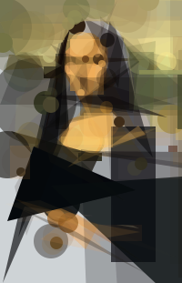
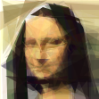
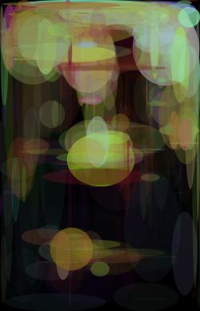
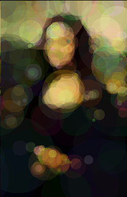

# The Evolution of a Smile

  

Various implementations of an evolutionary algorithm that aims to
reproduce the Mona Lisa with randomly mutated overlapping translucent shapes.

## Gallery

  
  

  
  Lena, triangles only

  
  Starry Night, triangles only 

  
  The Death of the Stag, triangles only.

## Fitness

The simplest fitness function to use is simply the pixel difference to the
reference image. To avoid a `sqrt` call, we can simplify to pixel difference
squared.

On it's own, the pixel difference has some really nice properties. For example,
there's always a way to improve, therefore the fitness function is convex and we
don't have to optimize for minima. It also converges nicely on a solution, as
with a large enough population, the greatest improvement corresponds to the
largest shape on the image.

There are a few reasons why I modified this. For a start, I wanted to get
results that used few overlapping shapes to make reasonable approximations. The
degenerative case is where the mutation simply adds a shape that improves a
single pixel, and the end result would be similar to a raster version of the
source.

As mentioned before, raw pixel difference does avoid this as the greatest
improvement corresponds to the greatest area shape per generation, however this
relies on a large population to maximise the generational maximum.

I wanted to use a very small population to reduce wasted cycles. With a large
population you find several improvements, and simply take the best N. Those
improvements without this set N are wasted effort. Additionally, the proportion
of children per generation that are improvements is small, so the chances of a
strain propagating is correspondingly small. Experimentation led me to believe
that it's more efficient to rapidly iterate on a small population, thus
incorporating more of the improvement into the fittest group.

In order to encourage the image with the fewest shapes, I therefore add 1% of
the pixel difference for each shape used. In practice, this means that each
additional shape needs to improve the image by 1%, which should get easier as
the overall fitness improves. This does introduce the possibility of local
minima however, so the function is no longer convex.

Another experiment I tried was to weight the pixels of the source image by
entropy (the combined square of neighboring pixels), and to subsequently weight 
the pixel difference by this.

## Optimisation

With the rust code I first coded a naive version that used a brute force pixel
drawing function for the circle generation. I then did a lot of profiling. It
was clear that the majority of the time was spent within the inner loops of the
pixel rendering.

At this point I also suspected that the allocation of the canvas was also slow.
Thinking to kill two birds with one stone, I created a cache of canvases
generated from the list of shapes. Because each generation only mutated a single
shape, this reduced the amount of computation needed by a massive amount.
Because manipulating the last shape in the list is the cheapest, I also weighted
the probability of the last shape manipulation.

These optimisations greatly improved the performance, but I also reimplemented
the draw functions to use Bresenheim's algorithm. 

## Project History

### 2009
In December 2008, [Roger Alsing](http://rogeralsing.com/2008/12/07/genetic-programming-evolution-of-mona-lisa/)
wrote a program that used a genetic algorithm to evolve an approximation of the
mona lisa using 50 overlapping polygons. The results were very impressive and
his report generated a lot of interest.

I was curious to try it myself, and wrote a quick version in python. At the
time, the source for Roger's program wasn't available (he's subsequently
released a .NET program with source, although I haven't looked at it), so I
guessed at how the program worked.

Instead of using a fixed set of polygons, I decided to use ellipses, initially
because the maths was easier, but subsequently because I like the abstract 'lava
lamp' look of the intermediary images. Rather than use a fixed array of shapes
like Roger, I used a fitness function that encouraged less shapes, and allowed
my mutation operation to add or remove ellipses.

Despite experimenting with a bunch of different image libraries, and using
psyco, the python program was prohibitively slow, only evolving a few thousand
generations per hour. I experimented with generation populations, varying
between 10 and 100 - it was interesting looking at how adjusting the parameters
affected the speed at which the fitness improved.

As the bottleneck in the program seemed to be the graphics library, I decided to
rewrite the program in c, manipulating arrays of pixels so the fitness
function would be blazing fast. Despite my rusty C skills, the many memory
leaks, and platform inconsistencies (OS X zero fills malloc allocations, linux
does not), I got a version running and left it overnight on a friends server.

Using a generation population of 100, in 19000 generations I had something that
looked vaguely Da Vinciesque. If you squinted, it looked pretty good. Curiosity
satisfied, I abandoned the project.

### 2010
A year later I was playing with html5. I was interested in splitting computation
between multiple browsers. One of my projects, a collaborative map-reduce
raytracer, uses multiple browsers to render an image into canvas. I was excited by
the capabilities of canvas, and started to write more and more javascript. My
server side code, a mess of python and mysql, limited the interest I had in
doing anything further with this.

A few months later I started toying with the idea of using a couchapp to simplify
the collaborative processing backend. Looking through my old projects, the mona
lisa code seemed perfect for this, so I rewrote the genetic algorithm in
javascript with the canvas.

This time I used circles instead of ellipses. And I add the ability to cross
breed between browsers. In 10,000 generations or so, I was getting interesting
images. And this time, you could see the images evolving.

Sadly in the intervening period, couchone was bought by couchbase and I
neglected to backup the data from the service. Sadly this means that the
interesting results were lost.

### 2017

On a whim, looking for a project to learn more [rust](rust-lang.org), I decided
to reimplement this project. This time I wanted to try different shapes,
including triangles and rectangles, and to experiment with optimizations to
speed up the evolution.

